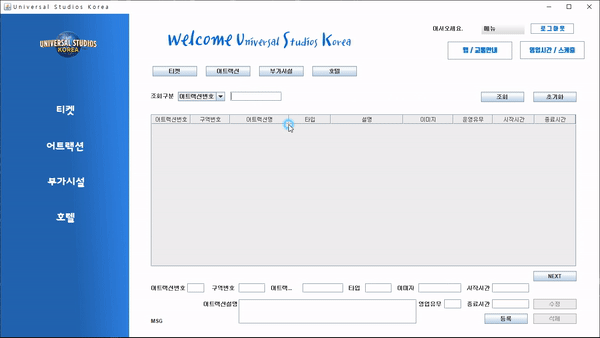
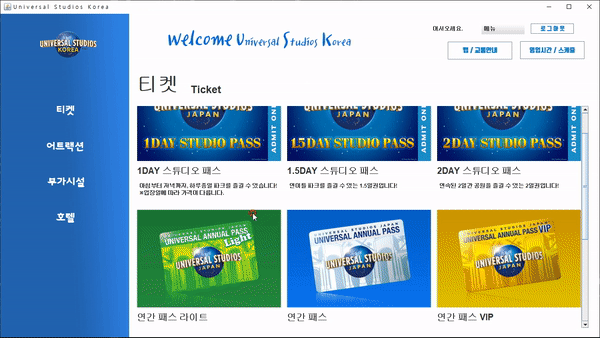

USK [ Universal Studios Korea ] . _Stand alone type_
===================================================
2020年12月から2021年7月までのJAVA研修で初めて作ったチームプロジェクトです。
1月21日から3月23日までの日程でした。
韓国にもユニバーサルスタジオができてほしいと願いの気持ちが込めてあります。
3人のチームになって主に担当した部分はログイン、会員登録、管理者メニュー、UI、管理者データベースとの連結です。


概要
----

* チケット販売所の混雑状況を回避する。
* ホームページから沢山の情報や訪れた客の感想、レビューを見る。
* ホームページ -> 情報提供 -> 予約・販売 -> 利益

<br>

<br>

使用技術
--------
* Oracle SQL
* JAVA
* eclipse
* Tortoise SVN
* Photoshop
* Illustrator
<br>

<br>

ERD / Class Diagram
-------------------

* [ERD](https://github.com/GtYoo/USK/blob/main/20210313_USK_ver2.1.png)
* [Class Diagram](https://github.com/GtYoo/USK/blob/main/usk_Class_diagram.png)

<br>

<br>

Detail
--------------
* MVCパターンを学ぶ前、開発しましたのでClassの部品化を使いこなせませんでした。
 今は現場で必ず使われてある `MVC` をちゃんと学んでいます。

* ログイン機能 - 会員情報をログインで利用するための[DTO Class](https://github.com/GtYoo/USK/tree/main/src/dto)を生成、`ログイン Class`で読み込む。
* 特に問題はありませんでしたが、データベースに会員情報を順番に入れるために `sequence` を利用して`PrimaryKey`を自動に入れることにしました。[MberJoinPopup.java ](https://github.com/GtYoo/USK/blob/main/src/usk/MberJoinPopup.java)
 ```java
 String insertMember = "INSERT INTO MBER VALUES(MBER_NO_SEQ.NEXTVAL,?,?,?,?,?,?)";
 ```


* 会員退会した場合、情報を削除することではなく企業の政策により保存期間を仮定定義しました。データベースに会員退会の可否 Columnを作って保存します。[MberModify.java](https://github.com/GtYoo/USK/blob/main/src/usk/MberModify.java)
 ```java
 String mberDelete = "UPDATE MBER SET MBER_ID = ?, PASSWORD = ?, MBER_NM = ?, EMAIL = ?, "
 "MOBLPHON = ?, MBER_SECSN_AT = ? WHERE MBER_ID = ?";
 ```
 ```java
 pstmt2 = con.prepareStatement(mberDelete);
 pstmt2.setString(1, id);
 pstmt2.setString(2, pw);
 pstmt2.setString(3, nm);
 pstmt2.setString(4, email);
 pstmt2.setString(5, tel);
 pstmt2.setString(6, "Y");
 pstmt2.setString(7, id);

 ret = pstmt2.executeUpdate();
 ```


* 管理者メニューで重要だと思った部分は「全ての情報に接近できるのか」でした。ページを一気に見せることではなく見せたい `Row属性` 数を決め、ボタンによって次々と見せます。

```java
String noSearch = "SELECT * FROM (SELECT O.* ,  ROWNUM RNUM FROM "
				+ "(SELECT M.MBER_ID, M.MBER_NM, R.RESVE_NO, R.RESVE_DE, S.ISSU_NO, S.SETLE_AMOUNT, "
				+ "S.SETLE_DT, S.CANCL_REQST_AT, S.COMPT_DT, S.CANCDE_COMPT_AT, M.MBER_NO, "
				+ "T.CMMN_CODE, T.TICKET_NO, R.ENTNC_DE, R.SETLE_AT "
				+ "FROM MBER M, RESVE R, SETLE S, TICKET T WHERE 1 = 1 AND M.MBER_NO = R.MBER_NO "
				+ "AND R.RESVE_NO = S.RESVE_NO AND T.TICKET_NO = R.TICKET_NO AND "
				+ "R.RESVE_NO >= ? ORDER BY RESVE_NO )O)"
				+ "WHERE RNUM >= ? AND ROWNUM <= ?";
```




* チケット予約機能

  データベースにあるチケット情報を読み込んで画面に表示

  `Widow builder`で作るのか大変で、全部苦労しました。




DATA SOURCE
------

[Univarsal studios japan](https://www.usj.co.jp/web/ja/jp), [Univarsal studios hollywood](https://www.universalstudioshollywood.com/)のイメージ、コンテンツを参考しました。
<br>

<br>

